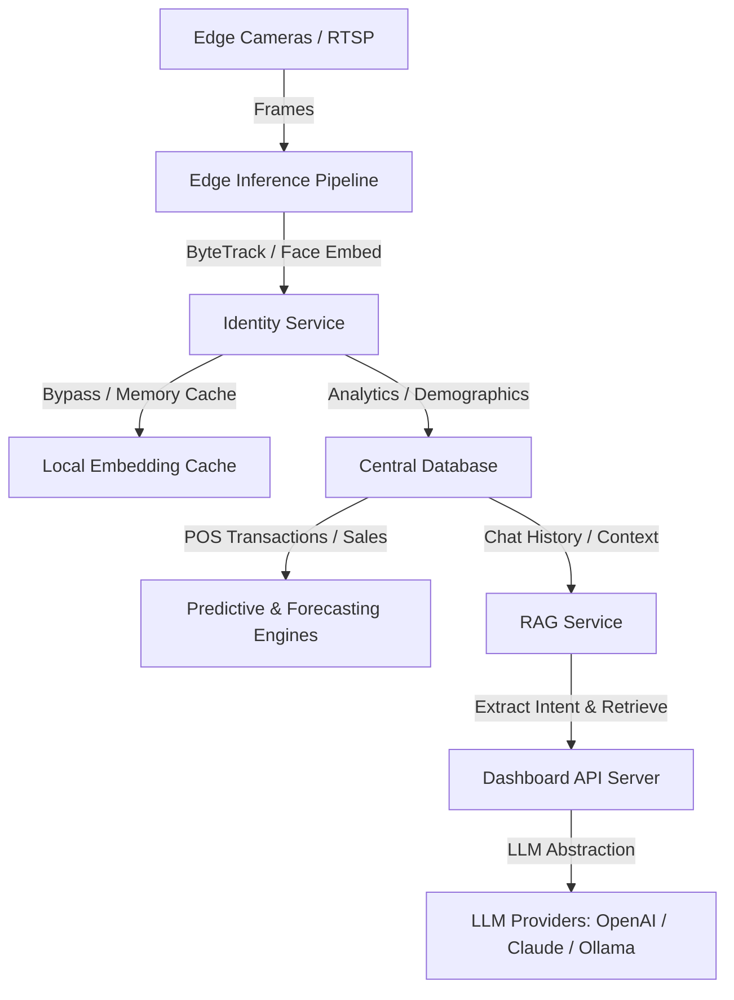

# AI Architecture and Deployment Guide (Phase 5)

This document covers the architectural layout, API contracts, machine learning models, and deployment configurations of the Orzen Vision Retail AI Platform's core intelligence layer.



---

## 1. LLM Intelligence Layer (Module 1)
The AI Assistant acts as a business analyst for store performance.

### Capabilities:
- **Natural Language Analytics**: Generates responses to questions like *"Which store performed best today?"*.
- **Executive Insights**: Synthesizes store metrics summaries.
- **Source Attribution**: Highlights exact SQL tables and records referenced for a query.
- **Memory**: Conversation history is persisted in `chat_sessions` and `chat_messages` tables.

### Setup Configurations:
Set in `.env`:
- `LLM_PROVIDER`: `openai` | `claude` | `azure` | `ollama` | `stub`
- `LLM_MODEL`: e.g. `gpt-4o-mini`, `claude-3-5-sonnet-20240620`, `llama3`
- `OPENAI_API_KEY` or `ANTHROPIC_API_KEY`: API authentication tokens.
- `LLM_BASE_URL`: Local endpoint URL for Ollama (`http://localhost:11434`).

---

## 2. Voice AI Backend (Module 2)
Handles speech interaction for executive dashboards.

- **STT (Speech-to-Text)**: Exposes `POST /api/v1/ai/voice/stt` accepting WAV/MP3 files. Routes via local `SpeechRecognition` or remote Whisper API. Supports bilingual (English/Hindi) transcription.
- **TTS (Text-to-Speech)**: Exposes `POST /api/v1/ai/voice/tts` generating high-quality MP3 voice files via Google Text-to-Speech (`gTTS`).

---

## 3. Predictive Analytics & Forecasting (Modules 3 & 4)
Features statistical and ML models running in the backend:

- **Footfall & Peak Hour Predictions**: Computes linear trends coupled with day-of-week seasonal adjustments. Evaluates hourly traffic weight distribution.
- **Repeat Visitors & Conversion Probability**: Computes conversion index by correlating footfall with POS transactions.
- **Forecasting Engine**: Exposes `GET /api/v1/ai/forecasts`. Predicts Revenue, Growth, and Customer Retention for daily, weekly, and monthly horizons. Generates **upper and lower 95% confidence intervals** based on residual standard errors:
  $$\text{Interval} = \text{Forecast} \pm 1.96 \times \text{Standard Error} \times \sqrt{1 + \frac{t}{30}}$$

---

## 4. Recommendation Engine (Module 5)
Exposes `GET /api/v1/ai/recommendations` to suggest:
- **Staffing allocation**: Scheduling staff matching predicted peak hours.
- **Layout optimization**: Recommending layout changes for low-engagement zones.
- **VIP Engagement**: Flagging top VIP repeat visitors for special loyalty events.

---

## 5. AI Alert Engine (Module 6)
Extends the core notification system to capture complex business anomalies:
- **VIP arrival** (Priority: HIGH)
- **Low conversion** (Priority: MEDIUM)
- **Camera offline** (Priority: CRITICAL)
- **Long queue** (Priority: HIGH)
- **Store anomaly** (Priority: HIGH)
- **Employee inactivity** (Priority: LOW)

Priority levels are structured inside the Alert JSON `payload` column to maintain database backward compatibility.

---

## 6. Security & Optimizations (Modules 7, 8, 10)
- **Rate Limiting**: Custom `RateLimitingMiddleware` limits requests on `/api/v1/ai` to 60 requests per minute per IP.
- **Audit Logs**: DPDP-compliant logs written to `audit_logs` tracking sensitive admin actions.
- **Edge ONNX Tuning**: Face detector leverages `TensorrtExecutionProvider` and `CUDAExecutionProvider` fallback configs.Decoupled background threading and dynamic frame-skipping ensure processing matches ingestion frame rates.
- **Cache Optimization**: In-memory embedding cache in `IdentityService` skips redundant matching on active tracking sequences.

---

## 7. API Reference Specs

### AI Assistant Chat
- **Endpoint**: `POST /api/v1/ai/assistant/chat`
- **Request**:
  ```json
  {
    "query": "Compare Mumbai and Bangalore today",
    "session_id": "optional-uuid"
  }
  ```
- **Response**:
  ```json
  {
    "session_id": "uuid",
    "answer": "...Markdown text...",
    "summary": "Short TL;DR summary",
    "kpis": [{"kpi": "total_visitors", "value": "120"}],
    "sources": [{"type": "database_aggregation", "detail": "..."}]
  }
  ```

### Predictions & Forecasts
- **Endpoint**: `GET /api/v1/ai/predictions?store_id=store-001&days_ahead=7`
- **Endpoint**: `GET /api/v1/ai/forecasts?store_id=store-001&horizon=weekly`

---

## 8. Troubleshooting
- **No Speech Recognition**: Make sure `speechrecognition` is installed. Check system microphone drivers if running locally.
- **sqlite3.OperationalError: no such column**: Run the backend server once to trigger `ensure_phase5_columns()` database migration.
- **TensorRT Provider Unavailable**: Verify CUDA, cuDNN, and TensorRT libraries match the versions supported by ONNX Runtime. Falls back to CUDA or CPU execution automatically.
